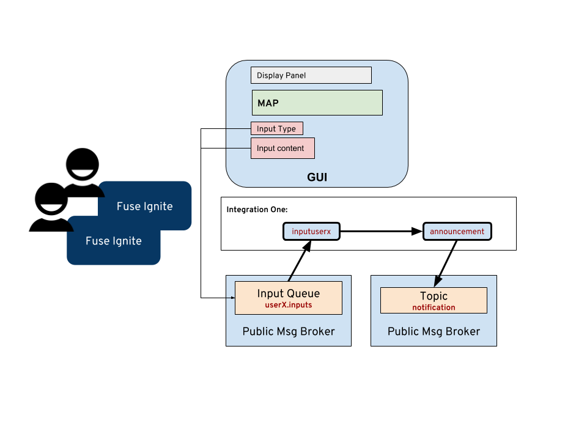
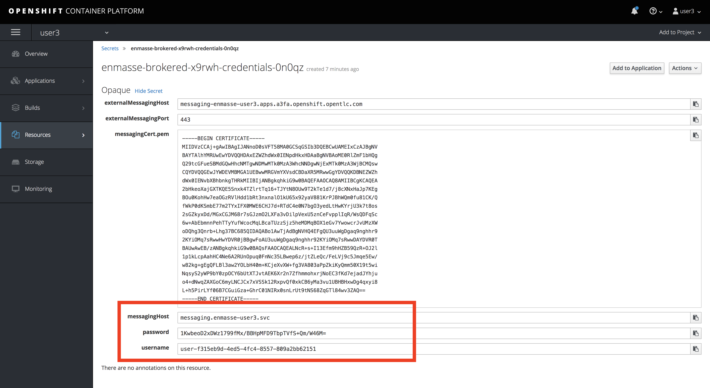
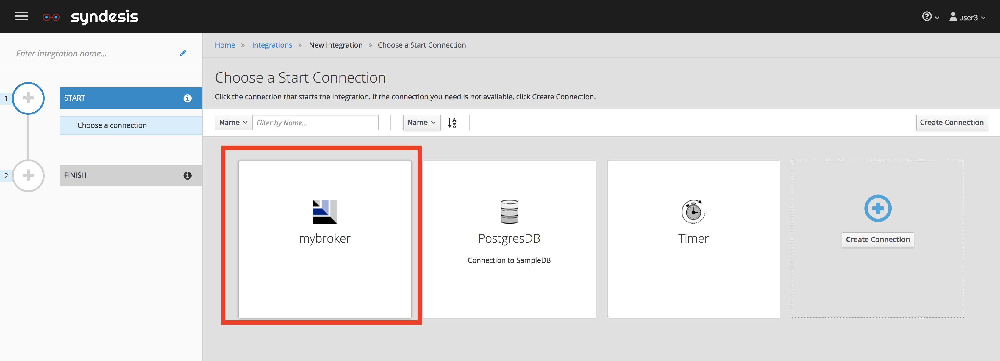
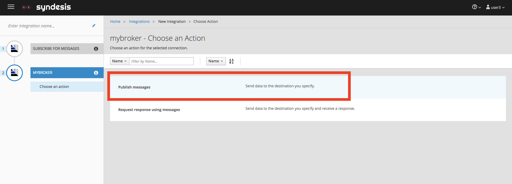
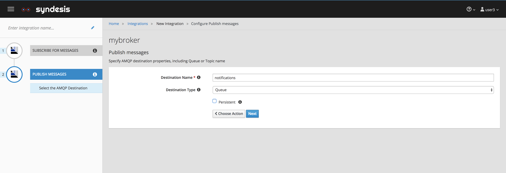
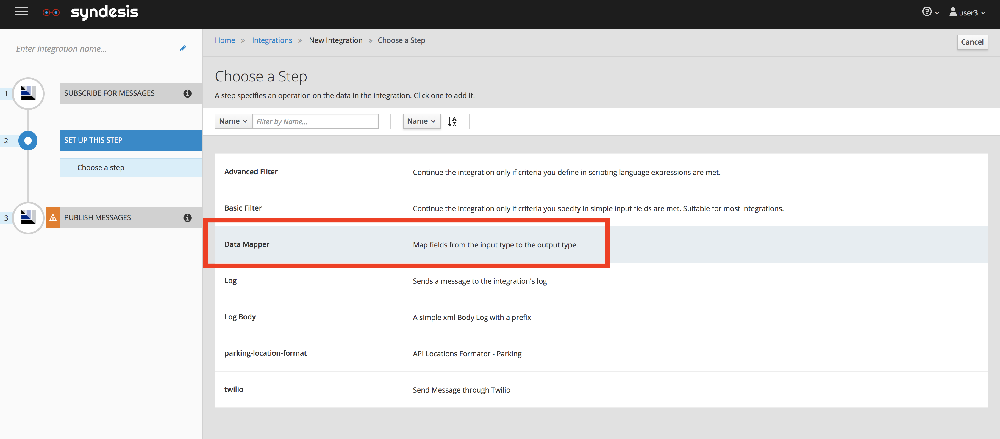
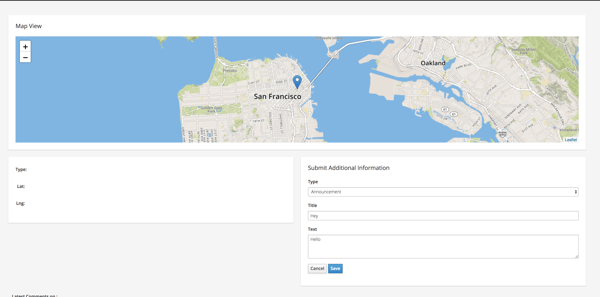
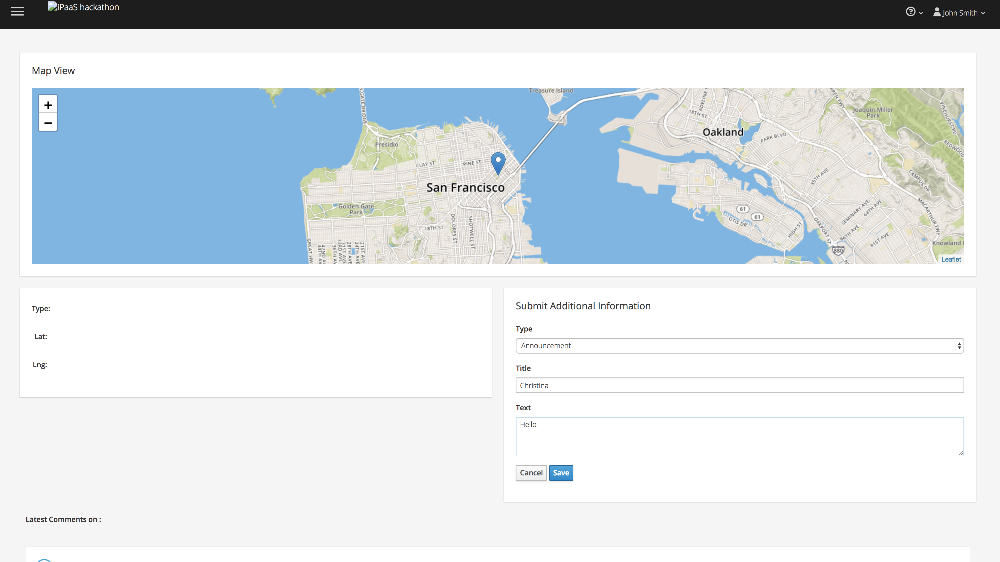

# First Hack - Data Shapes and Data Mapper
-Instructor lead-

Publishing input and receiving from announcement topic!



- Add connection for messaging broker for Input queue and announcement topic
Select the **Connections** on the side menu, and click on **Add Connection** button on the top right hand corner.


- Click on the AMQP Connector.


- Configure your AMQP settings accordingly, all the information should be avaliable in your OSE env, within the Broker's secret setting. 

   	- Connection URL : amqp://*messagingHost* 
   	- User Name: *username*
   	- Password: *password*
   	- Check Certificate: *Disable*

- And click **Next** when done. 




- Give a name to your broker connection, and click **create** 


- **Create new integration**. Select the **Integration** on the side menu, and click on **Create Integration** in the center.


- Select < YOUR_BROKER_CONNECTION > .


- Select *subscribe for messages action*. 


- Configure the name of the queue to listen
	- Destination Name: inputs
	- Destination Type: Queue 


- Configure the Output data type,  
  	- Select Type: JSON Instance
	- Definition: 
	
```
{
  "type": "announcement",
  "content": {
    "title": "Tester",
    "text": "This is the message for everyone!!"
  }
}
```


- For end connector setting, and select the <YOUR_BROKER_CONNECTION>   


- Select *Publish messages action*. 


- Configure the name of the queue to listen
	- Destination Name: notifications
	- Destination Type: Topic 


- Configure the Output data type,  
  	- Select Type: JSON Instance
	- Definition: 
	
```
{
  "type": "Success",
  "header": "Christina",
  "message": "This is the message for <strong>everyone</strong>!!"
}
```	


- Select *Add a Step* in the center


- Select *Data Mapper* in action


- Add two contant by clicking in the Source column **"+"** of *Constants* drop down menu. 
	- <YOUR_NAME>
	- Warning 


- Drag and connect from Source to Target and click in **Done**
	- Custom -> Content -> text **to** message
	- Custom -> Content -> title  **to** header
	- Constants -> Warning **to** type 


- Give a name to integration and click in **Finish**


- Go to your UI, *http://www-hackathon-ui-<USER_NAME>.apps.<ID>.openshift.opentlc.com/*
,in the input panel, 
	- Tyoe: Annoucement
	- Titles: < YOUR_NAME >
	- Text: Hello



- You should see a small alert pop up on the top righthand corner.

