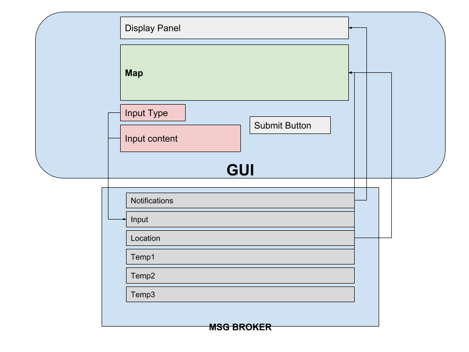

# L1120 iPaaS Hackathon

Welcome to this hackathon. Putting integration solution together used to take days and you will have to have some sort of coding background to successfully put data from various services together. Today, with Red Hat's low code iPaaS platform, we will use the minimum number of codes to achieve maximum integration results! 

First of all, give us 15 mins to walk through the tooling platform with you,  so you know where everything is. After that we will let you work on two instructor lead integration scenarios, to get you familiar with the environment, and platform. Then you are free to hack it away! 

- [Background](#background)
	- Location API Services
	- Deployment on AMQ Online
	- Working with GUI
	- Communicating with the Notifications Display 
	- Showing Locations in the Map
	- Data from Input
- [Lab instructions](#lab-instructions)
	- Configure Broker
	- Add API Connectors
	- Add Technical Extension
	- First Hack
	- Second Hack

## Background 


### Location API Services

Go to the following links to access  (login with your user id/pwd)
API documents of the services 

[https://fusedemo.3scale.net/docs](https://fusedemo.3scale.net/docs)

| API Service Name | User Key |
|------------------|----------|
| **Restaurant Locations** | d2b8f9e059c2bbfc1a5c7b1cb8115d60 |
| **ATM Locations** |  b88456bf863608f5b79324eae13a4e46 |
| **Parking locations** | 73917fb7c1c8d7142a5db4d6f0ec4a97 |
| **Bar locations** |  f6ba725532f6797d5dc7afbf8c012c20 |
| **Store locations** | b62940ff7a175691e0396b28ceaa0bf4 |

### Deployment on AMQ Online

We will have ONE single Topic that everyone listen to for announcement! 

- 1 queue for __display__
- 1 queue for __input__
- 1 queue for __location display in map__
- 3 queues in case the participants needs it, __temp queues__


### Working with GUI

Navigate to [http://www-hackathon-ui-\<YOURUSERID\>.apps.hackahton.openshiftworkshop.com](http://www-hackathon-ui-<YOURUSERID>.apps.hackahton.openshiftworkshop.com) in your browser. This is where you can use to display the result, and places for you to submit input as well.  To interact you will need to pass/retrive data from messaging queues you created in your address space!



### Communicating with the Notifications Display 

To display messages in the notifications widget, you will need to send the text into the receiving message broker topic. And you will need to follow the data format listed below: 

```
{
  "type": "Success",
  "header": "Christina",
  "message": "This is the message for <strong>everyone</strong>!!"
}
```

Message body allows non-abusive use of HTML. You can use one of the following message types:

* Info
* Success
* Warning
* Danger


### Showing Locations in the Map
Map allows you to pin point and mark multiple locations, the location can be set by passing into the receiving message broker queue with the data format below:

````
[
   {
      "location":{
         "lat":37.784323,
         "lng":-122.40069
      },
      "title":"Moscone Center",
      "type":"Point of Interest",
      "id":"109"
   },
   {
      "location":{
         "lat":37.785905,
         "lng":-122.413022
      },
      "title":"Hilton Union Square",
      "type":"Hotel",
      "id":"203"
   }
]
````


### Data from Input
Inputs are collected and formatted into a messaging broker queue ready for you to process after submitting it with the submit button. An example of the data is show below:

```
{
  "type": "announcement",
  "content": {
    "title": "Tester",
    "text": "This is the message for everyone!!"
  }
}
```


## LAB Instructions

### Configure Broker

To provision messaging service infrastructure by following the [instructions](docs/service-catalog-tutorial.md). 

### Deploy UI Web Application

Deploy the web application UI with these [instructions](docs/web-application-ui.md).

### Add API Connectors

There are five SaaS location service provided, you will need to setup up in Fuse to use it, here is how. [Click me](docs/custom-api-connector.md)

### Add Technical Extension

To step up, you can also use the following services for follow this [Link](docs/tech-extension.md) to install the tech extension.

### First Hack

- Follow the [instructions](docs/hack-01.md) 

### Second Hack

- Follow the [instructions](docs/hack-02.md) 

## Off you go 
Have fun Hacking!
