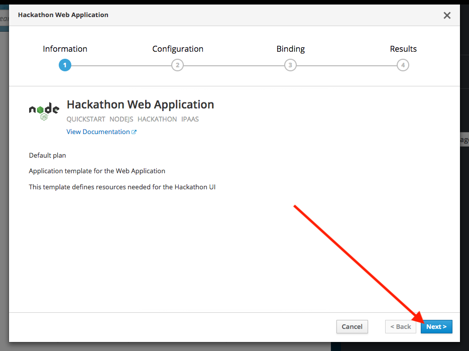

## Deploying Web Application

You can now deploy the Hackathon UI Web Application. It will become the point of interface with the backend integrations through the addresses you define in the previous step. 

### IMPORTANT

Accept the self-signed certificates before using the UI or it won't be able to connect. In a browser tab go to: 

    https://<REPLACE-WITH-YOUR-MESSAGING-HOST> 

Accept the certificate validation and then reload your the web application UI.

To deploy the application complete the following steps:

1. In the OpenShift Service Catalog overview, select **Hackathon Web Application**.

    

1. Click on **Next >**.

    

1. Fill in the connection configuration to the messaging environment. You collected the information in the last step of the previous section: _Create Application Credentials_.Then click on **Next >**.

    

    Scroll down and fill in the addresses names.

    

1. In the next screen select **Do not bind at this time**. Click on **Create**.

    

1. In the final step of the wizard click on the **Continue to the project overview** link,

    

It will take a few minutes for the server to provision.

The build will start automatically.

After the build is over and the application has been deployed you can click on the application URL to access the UI.
